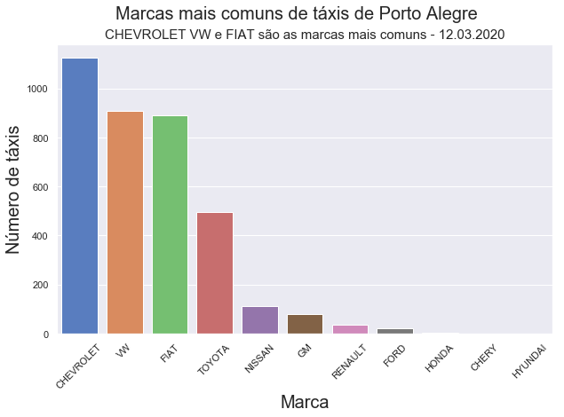
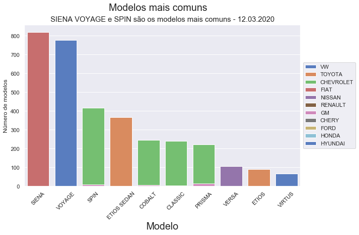
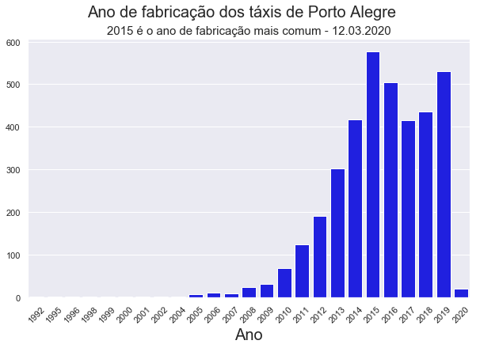
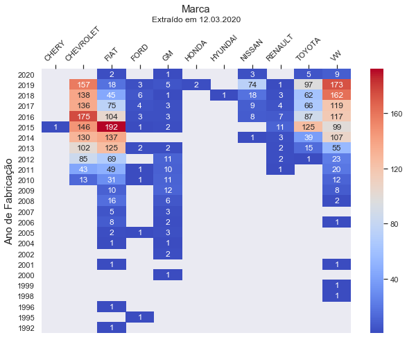
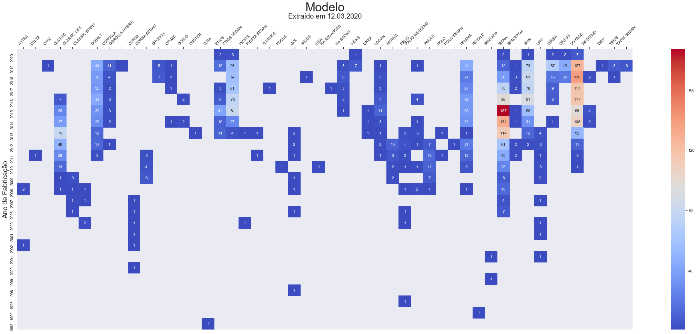

# <p style="text-align: center;"> Análise de dados da frota de táxis de Porto Alegre/RS </p>


<p style="text-align: center;"> Foto: Eduardo Paganella / Agencia RBS</p>

Este notebook faz a importação de dados relativos à frota de táxis direto do site da Prefeitura de Porto Alegre, manipula os dados através da engenharia de recuros e realiza uma breve análise exploratória.

## Importando bibliotecas necessárias


```python
import pandas as pd
import matplotlib.pyplot as plt
import seaborn as sns
from tqdm.notebook import tqdm
%matplotlib inline
```

## Importando dados atualizados do site da prefeitura


```python
url = 'https://dadosabertos.poa.br/dataset/9919770d-c0ac-47d2-84d0-c0061b2937c4/resource/f156879a-6921-44e9-99af-964d30367077/download/frota_taxi.csv'
taxi = pd.read_csv(url, sep=';')
```

## Checando tabela inicial


```python
taxi.head()
```


<div>
<style scoped>
    .dataframe tbody tr th:only-of-type {
        vertical-align: middle;
    }

    .dataframe tbody tr th {
        vertical-align: top;
    }

    .dataframe thead th {
        text-align: right;
    }
</style>
<table border="1" class="dataframe">
  <thead>
    <tr style="text-align: right;">
      <th></th>
      <th>data_extracao</th>
      <th>prefixo</th>
      <th>ponto</th>
      <th>placa</th>
      <th>marca</th>
      <th>modelo</th>
      <th>data_primeiro_emplac</th>
      <th>ano_fabricacao</th>
      <th>combustivel</th>
      <th>álcool</th>
      <th>gasolina</th>
      <th>GNV</th>
      <th>elétrico</th>
    </tr>
  </thead>
  <tbody>
    <tr>
      <th>0</th>
      <td>2020-03-12 01:58:27.228285</td>
      <td>3247</td>
      <td>HOSPITAL PRONTO SOCORRO (HPS)</td>
      <td>IYO1026</td>
      <td>VW</td>
      <td>VOYAGE</td>
      <td>2018-05-28</td>
      <td>2018</td>
      <td>ÁLCOOL/GASOLINA/GNV</td>
      <td>1</td>
      <td>1</td>
      <td>1</td>
      <td>0</td>
    </tr>
    <tr>
      <th>1</th>
      <td>2020-03-12 01:58:27.228285</td>
      <td>3655</td>
      <td>SHOPPING CENTER IGUATEMI II</td>
      <td>IYX1491</td>
      <td>TOYOTA</td>
      <td>ETIOS SEDAN</td>
      <td>2018-11-14</td>
      <td>2018</td>
      <td>ÁLCOOL/GASOLINA</td>
      <td>1</td>
      <td>1</td>
      <td>0</td>
      <td>0</td>
    </tr>
    <tr>
      <th>2</th>
      <td>2020-03-12 01:58:27.228285</td>
      <td>4339</td>
      <td>HOTEL LANCASTER</td>
      <td>ITI0860</td>
      <td>CHEVROLET</td>
      <td>COBALT</td>
      <td>2012-07-20</td>
      <td>2012</td>
      <td>ÁLCOOL/GASOLINA/GNV</td>
      <td>1</td>
      <td>1</td>
      <td>1</td>
      <td>0</td>
    </tr>
    <tr>
      <th>3</th>
      <td>2020-03-12 01:58:27.228285</td>
      <td>3748</td>
      <td>NaN</td>
      <td>IXQ7200</td>
      <td>TOYOTA</td>
      <td>ETIOS SEDAN</td>
      <td>2017-01-13</td>
      <td>2016</td>
      <td>ÁLCOOL/GASOLINA</td>
      <td>1</td>
      <td>1</td>
      <td>0</td>
      <td>0</td>
    </tr>
    <tr>
      <th>4</th>
      <td>2020-03-12 01:58:27.228285</td>
      <td>3108</td>
      <td>NaN</td>
      <td>IWQ2948</td>
      <td>VW</td>
      <td>VOYAGE</td>
      <td>2015-07-02</td>
      <td>2015</td>
      <td>ÁLCOOL/GASOLINA/GNV</td>
      <td>1</td>
      <td>1</td>
      <td>1</td>
      <td>0</td>
    </tr>
  </tbody>
</table>
</div>


## Engenharia de recursos inicial

A engenharia de recursos é necessária pois a coluna de combustível não está padronizada. Também é importante criar um dataframe para cada combustível, eles serão usados na visualização de dados. O arquivo com o dataframe principal será salvo como CSV contendo a data da extração.

Esta etapa pode levar até 20 minutos.


```python
##########################################
# Corrige as discrepâncias na coluna dos combustíveis
##########################################

taxi["combustivel"].replace({"ALCOOL/GASOLINA": "ÁLCOOL/GASOLINA", # Acento
                            'ALCOOL/GASOLINA/ELÉTRICO': 'ÁLCOOL/GASOLINA/ELÉTRICO', # Acento
                            'ÁLCOOL-GASOLINA': 'ÁLCOOL/GASOLINA', # Hífen por barra
                            'GNV-ÁLCOOL-GASOLINA': 'ÁLCOOL/GASOLINA/GNV', # Hífen por barra
                            'GNV-GASOLINA': 'GASOLINA/GNV', # Hífen por barra
                            'GNV-ÁLCOOL': 'ÁLCOOL/GNV'}, # Hífen por barra
                            inplace=True)

##########################################
# Cria colunas dummy para os tipos de combustível
##########################################
taxi['álcool'] = 0
for x in tqdm(range(0, len(taxi))):
    if taxi['combustivel'].loc[x].find('ÁLCOOL') != -1:
        taxi['álcool'][x] = 1
        print('Álcool pronto')
        
taxi['gasolina'] = 0
for x in tqdm(range(0, len(taxi))):
    if taxi['combustivel'].loc[x].find('GASOLINA') != -1:
        taxi['gasolina'][x] = 1
        print('Gasolina pronto')
        
taxi['GNV'] = 0
for x in tqdm(range(0, len(taxi))):
    if taxi['combustivel'].loc[x].find('GNV') != -1:
        taxi['GNV'][x] = 1
        print('GNV pronto')
        
taxi['elétrico'] = 0
for x in tqdm(range(0, len(taxi))):
    if taxi['combustivel'].loc[x].find('ELÉTRICO') != -1:
        taxi['elétrico'][x] = 1
        print('Elétrico pronto')

##########################################
# Cria dataframes para os combustíveis (serão usados mais adiante)
##########################################
taxi_gasolina = taxi[taxi['gasolina'] == 1]
taxi_alcool = taxi[taxi['álcool'] == 1]
taxi_gnv = taxi[taxi['GNV'] == 1]

##########################################
# Cria uma variável com a data de extração
##########################################
date = pd.to_datetime(taxi['data_extracao'].unique())
dia = "{:02d}".format(date.day[0])
mes = "{:02d}".format(date.month[0])
ano = date.year[0]
data_extracao = '.'.join([str(dia), str(mes), str(ano)])

# Salvando dataframe como CSV
taxi.to_csv(''.join(['taxi', '_', data_extracao, '.csv']))
```


    HBox(children=(FloatProgress(value=0.0, max=3677.0), HTML(value='')))


    C:\ProgramData\Anaconda3\lib\site-packages\ipykernel_launcher.py:19: SettingWithCopyWarning: 
    A value is trying to be set on a copy of a slice from a DataFrame
    
    See the caveats in the documentation: http://pandas.pydata.org/pandas-docs/stable/indexing.html#indexing-view-versus-copy
    

    
    


    HBox(children=(FloatProgress(value=0.0, max=3677.0), HTML(value='')))


    C:\ProgramData\Anaconda3\lib\site-packages\ipykernel_launcher.py:24: SettingWithCopyWarning: 
    A value is trying to be set on a copy of a slice from a DataFrame
    
    See the caveats in the documentation: http://pandas.pydata.org/pandas-docs/stable/indexing.html#indexing-view-versus-copy
    

    
    


    HBox(children=(FloatProgress(value=0.0, max=3677.0), HTML(value='')))


    C:\ProgramData\Anaconda3\lib\site-packages\ipykernel_launcher.py:29: SettingWithCopyWarning: 
    A value is trying to be set on a copy of a slice from a DataFrame
    
    See the caveats in the documentation: http://pandas.pydata.org/pandas-docs/stable/indexing.html#indexing-view-versus-copy
    

    
    


    HBox(children=(FloatProgress(value=0.0, max=3677.0), HTML(value='')))


    C:\ProgramData\Anaconda3\lib\site-packages\ipykernel_launcher.py:34: SettingWithCopyWarning: 
    A value is trying to be set on a copy of a slice from a DataFrame
    
    See the caveats in the documentation: http://pandas.pydata.org/pandas-docs/stable/indexing.html#indexing-view-versus-copy
    

    
    

Caso o arquivo já esteja baixado e manipulado:


```python
taxi = pd.read_csv('taxi_12.03.2020.csv', index_col=0)
```

# Análise de dados exploratória

Iniciamos a análise de dados exploratória com as funções describe(), info() e head(). Há apenas dados faltando na coluna 'ponto', que indica se o táxi possui ou não ponto fixo.


```python
taxi.describe()
```


<div>
<style scoped>
    .dataframe tbody tr th:only-of-type {
        vertical-align: middle;
    }

    .dataframe tbody tr th {
        vertical-align: top;
    }

    .dataframe thead th {
        text-align: right;
    }
</style>
<table border="1" class="dataframe">
  <thead>
    <tr style="text-align: right;">
      <th></th>
      <th>prefixo</th>
      <th>ano_fabricacao</th>
      <th>álcool</th>
      <th>gasolina</th>
      <th>GNV</th>
      <th>elétrico</th>
    </tr>
  </thead>
  <tbody>
    <tr>
      <th>count</th>
      <td>3677.000000</td>
      <td>3677.000000</td>
      <td>3677.000000</td>
      <td>3677.000000</td>
      <td>3677.000000</td>
      <td>3677.000000</td>
    </tr>
    <tr>
      <th>mean</th>
      <td>3015.018221</td>
      <td>2015.455534</td>
      <td>0.997824</td>
      <td>0.998096</td>
      <td>0.646451</td>
      <td>0.000544</td>
    </tr>
    <tr>
      <th>std</th>
      <td>1178.171015</td>
      <td>2.790859</td>
      <td>0.046600</td>
      <td>0.043596</td>
      <td>0.478136</td>
      <td>0.023319</td>
    </tr>
    <tr>
      <th>min</th>
      <td>1002.000000</td>
      <td>1992.000000</td>
      <td>0.000000</td>
      <td>0.000000</td>
      <td>0.000000</td>
      <td>0.000000</td>
    </tr>
    <tr>
      <th>25%</th>
      <td>1992.000000</td>
      <td>2014.000000</td>
      <td>1.000000</td>
      <td>1.000000</td>
      <td>0.000000</td>
      <td>0.000000</td>
    </tr>
    <tr>
      <th>50%</th>
      <td>2994.000000</td>
      <td>2016.000000</td>
      <td>1.000000</td>
      <td>1.000000</td>
      <td>1.000000</td>
      <td>0.000000</td>
    </tr>
    <tr>
      <th>75%</th>
      <td>4033.000000</td>
      <td>2018.000000</td>
      <td>1.000000</td>
      <td>1.000000</td>
      <td>1.000000</td>
      <td>0.000000</td>
    </tr>
    <tr>
      <th>max</th>
      <td>5094.000000</td>
      <td>2020.000000</td>
      <td>1.000000</td>
      <td>1.000000</td>
      <td>1.000000</td>
      <td>1.000000</td>
    </tr>
  </tbody>
</table>
</div>


```python
taxi.info()
```

    <class 'pandas.core.frame.DataFrame'>
    RangeIndex: 3677 entries, 0 to 3676
    Data columns (total 13 columns):
    data_extracao           3677 non-null object
    prefixo                 3677 non-null int64
    ponto                   2520 non-null object
    placa                   3677 non-null object
    marca                   3677 non-null object
    modelo                  3677 non-null object
    data_primeiro_emplac    3677 non-null object
    ano_fabricacao          3677 non-null int64
    combustivel             3677 non-null object
    álcool                  3677 non-null int64
    gasolina                3677 non-null int64
    GNV                     3677 non-null int64
    elétrico                3677 non-null int64
    dtypes: int64(6), object(7)
    memory usage: 373.5+ KB
    


```python
taxi.head()
```


<div>
<style scoped>
    .dataframe tbody tr th:only-of-type {
        vertical-align: middle;
    }

    .dataframe tbody tr th {
        vertical-align: top;
    }

    .dataframe thead th {
        text-align: right;
    }
</style>
<table border="1" class="dataframe">
  <thead>
    <tr style="text-align: right;">
      <th></th>
      <th>data_extracao</th>
      <th>prefixo</th>
      <th>ponto</th>
      <th>placa</th>
      <th>marca</th>
      <th>modelo</th>
      <th>data_primeiro_emplac</th>
      <th>ano_fabricacao</th>
      <th>combustivel</th>
      <th>álcool</th>
      <th>gasolina</th>
      <th>GNV</th>
      <th>elétrico</th>
    </tr>
  </thead>
  <tbody>
    <tr>
      <th>0</th>
      <td>2020-03-12 01:58:27.228285</td>
      <td>3247</td>
      <td>HOSPITAL PRONTO SOCORRO (HPS)</td>
      <td>IYO1026</td>
      <td>VW</td>
      <td>VOYAGE</td>
      <td>2018-05-28</td>
      <td>2018</td>
      <td>ÁLCOOL/GASOLINA/GNV</td>
      <td>1</td>
      <td>1</td>
      <td>1</td>
      <td>0</td>
    </tr>
    <tr>
      <th>1</th>
      <td>2020-03-12 01:58:27.228285</td>
      <td>3655</td>
      <td>SHOPPING CENTER IGUATEMI II</td>
      <td>IYX1491</td>
      <td>TOYOTA</td>
      <td>ETIOS SEDAN</td>
      <td>2018-11-14</td>
      <td>2018</td>
      <td>ÁLCOOL/GASOLINA</td>
      <td>1</td>
      <td>1</td>
      <td>0</td>
      <td>0</td>
    </tr>
    <tr>
      <th>2</th>
      <td>2020-03-12 01:58:27.228285</td>
      <td>4339</td>
      <td>HOTEL LANCASTER</td>
      <td>ITI0860</td>
      <td>CHEVROLET</td>
      <td>COBALT</td>
      <td>2012-07-20</td>
      <td>2012</td>
      <td>ÁLCOOL/GASOLINA/GNV</td>
      <td>1</td>
      <td>1</td>
      <td>1</td>
      <td>0</td>
    </tr>
    <tr>
      <th>3</th>
      <td>2020-03-12 01:58:27.228285</td>
      <td>3748</td>
      <td>NaN</td>
      <td>IXQ7200</td>
      <td>TOYOTA</td>
      <td>ETIOS SEDAN</td>
      <td>2017-01-13</td>
      <td>2016</td>
      <td>ÁLCOOL/GASOLINA</td>
      <td>1</td>
      <td>1</td>
      <td>0</td>
      <td>0</td>
    </tr>
    <tr>
      <th>4</th>
      <td>2020-03-12 01:58:27.228285</td>
      <td>3108</td>
      <td>NaN</td>
      <td>IWQ2948</td>
      <td>VW</td>
      <td>VOYAGE</td>
      <td>2015-07-02</td>
      <td>2015</td>
      <td>ÁLCOOL/GASOLINA/GNV</td>
      <td>1</td>
      <td>1</td>
      <td>1</td>
      <td>0</td>
    </tr>
  </tbody>
</table>
</div>


## Marcas

Primeiro consultamos as principais marcas de carros e armazenamos as mais frequentes.


```python
marca1 = taxi['marca'].value_counts().index[0]
marca2 = taxi['marca'].value_counts().index[1]
marca3 = taxi['marca'].value_counts().index[2]
taxi['marca'].value_counts()
```


    CHEVROLET    1125
    VW            910
    FIAT          892
    TOYOTA        497
    NISSAN        113
    GM             79
    RENAULT        34
    FORD           23
    HONDA           2
    CHERY           1
    HYUNDAI         1
    Name: marca, dtype: int64


 Então, geramos o gráfico de contagem com as principais marcas de carros.


```python
sns.set(style="darkgrid")
plt.figure(figsize=(10,6))
sns.countplot(x='marca',data=taxi,
              order = taxi['marca'].value_counts().index, palette='muted')
plt.xticks(rotation=45)
plt.xlabel('Marca', size=20)
plt.ylabel('Número de táxis', size=20)
plt.suptitle('Marcas mais comuns de táxis de Porto Alegre', size=20, horizontalalignment='center')
plt.title(' '.join([marca1, marca2, 'e', marca3, 'são as marcas mais comuns -', data_extracao]) , size=15)
```


    Text(0.5, 1.0, 'CHEVROLET VW e FIAT são as marcas mais comuns - 12.03.2020')





## Principais modelos de carros usados por taxistas

De maneira similar às marcas, primeiro consultamos os principais modelos de carros e armazenamos os mais frequentes.


```python
modelo1 = taxi['modelo'].value_counts().index[0]
modelo2 = taxi['modelo'].value_counts().index[1]
modelo3 = taxi['modelo'].value_counts().index[2]
taxi['modelo'].value_counts().head(20)
```


    SIENA            818
    VOYAGE           778
    SPIN             423
    ETIOS SEDAN      365
    COBALT           249
    CLASSIC          241
    PRISMA           235
    VERSA            105
    ETIOS             90
    VIRTUS            67
    PARATI            39
    LOGAN             32
    COROLLA           26
    MERIVA            20
    UNO               17
    KA SEDAN          16
    PALIO             15
    PALIO WEEKEND     13
    CORSA SEDAN       13
    CRONOS            12
    Name: modelo, dtype: int64


```python
sns.set(style="darkgrid")
plt.figure(figsize=(10,6))
sns.countplot(x='modelo',data=taxi,
              order = taxi['modelo'].value_counts().head(10).index, hue='marca', dodge=False, palette='muted')
plt.xticks(rotation=45)
plt.legend(loc='center left', bbox_to_anchor=(1, 0.5))
plt.xticks(rotation=45)
plt.xlabel('Modelo', size=20)
plt.ylabel('Número de modelos')
plt.suptitle('Modelos mais comuns', size=20, horizontalalignment='center')
plt.title('Siena e Voyage são os mais comuns de táxis de Porto Alegre')
plt.title(' '.join([modelo1, modelo2, 'e', modelo3, 'são os modelos mais comuns -', data_extracao]) , size=15)
```


    Text(0.5, 1.0, 'SIENA VOYAGE e SPIN são os modelos mais comuns - 12.03.2020')





## Principais anos de fabricação dos táxis

Agora faremos a análise do anos de fabricação mais frequentes.


```python
taxi['ano_fabricacao'].value_counts().head(10)
```


    2015    577
    2019    530
    2016    504
    2018    436
    2014    417
    2017    416
    2013    303
    2012    191
    2011    124
    2010     68
    Name: ano_fabricacao, dtype: int64


```python
ano_mais_frequente = str(taxi['ano_fabricacao'].value_counts().index[0])
```


```python
plt.figure(figsize=(10,6))
sns.countplot(x='ano_fabricacao',data=taxi, color='blue')
plt.xticks(rotation=45)
plt.ylabel('', size=20)
plt.xlabel('Ano', size=20)
plt.suptitle('Ano de fabricação dos táxis de Porto Alegre', size=20)
plt.title(' '.join([ano_mais_frequente,'é o ano de fabricação mais comum -', data_extracao]), size=15, horizontalalignment='center')
```


    Text(0.5, 1.0, '2015 é o ano de fabricação mais comum - 12.03.2020')





## Combustível

Geramos os dados relativos de combustíveis e depois criamos um dataframe com as proporções. Gasolina e álcool são os combustíveis predominantes, mas o GNV também é bastante frequente.


```python
taxi['combustivel'].value_counts()
```


    ÁLCOOL/GASOLINA/GNV         2366
    ÁLCOOL/GASOLINA             1294
    GASOLINA/GNV                   6
    ÁLCOOL/GNV                     5
    ÁLCOOL                         2
    GASOLINA                       2
    ÁLCOOL/GASOLINA/ELÉTRICO       2
    Name: combustivel, dtype: int64


```python
alcool_porcento = '{:.2%}'.format(taxi[taxi['álcool'] == 1]['álcool'].sum()/len(taxi['álcool']))
GNV_porcento = '{:.2%}'.format(taxi[taxi['GNV'] == 1]['GNV'].sum()/len(taxi['GNV']))
gasolina_porcento = '{:.2%}'.format(taxi[taxi['gasolina'] == 1]['gasolina'].sum()/len(taxi['gasolina']))
elétrico_porcento = '{:.2%}'.format(taxi[taxi['elétrico'] == 1]['elétrico'].sum()/len(taxi['elétrico']))
```


```python
combustivel_porcento = pd.DataFrame(data=[gasolina_porcento, alcool_porcento, GNV_porcento, elétrico_porcento], index=['Gasolina', 'Álcool', 'GNV', 'Elétrico'], columns=['Combustível'])
combustivel_porcento
```


<div>
<style scoped>
    .dataframe tbody tr th:only-of-type {
        vertical-align: middle;
    }

    .dataframe tbody tr th {
        vertical-align: top;
    }

    .dataframe thead th {
        text-align: right;
    }
</style>
<table border="1" class="dataframe">
  <thead>
    <tr style="text-align: right;">
      <th></th>
      <th>Combustível</th>
    </tr>
  </thead>
  <tbody>
    <tr>
      <th>Gasolina</th>
      <td>99.81%</td>
    </tr>
    <tr>
      <th>Álcool</th>
      <td>99.78%</td>
    </tr>
    <tr>
      <th>GNV</th>
      <td>64.65%</td>
    </tr>
    <tr>
      <th>Elétrico</th>
      <td>0.05%</td>
    </tr>
  </tbody>
</table>
</div>


Há uma pequena frota de táxis elétricos em Porto Alege/RS


```python
taxi[taxi['elétrico'] == 1]
```


<div>
<style scoped>
    .dataframe tbody tr th:only-of-type {
        vertical-align: middle;
    }

    .dataframe tbody tr th {
        vertical-align: top;
    }

    .dataframe thead th {
        text-align: right;
    }
</style>
<table border="1" class="dataframe">
  <thead>
    <tr style="text-align: right;">
      <th></th>
      <th>data_extracao</th>
      <th>prefixo</th>
      <th>ponto</th>
      <th>placa</th>
      <th>marca</th>
      <th>modelo</th>
      <th>data_primeiro_emplac</th>
      <th>ano_fabricacao</th>
      <th>combustivel</th>
      <th>álcool</th>
      <th>gasolina</th>
      <th>GNV</th>
      <th>elétrico</th>
    </tr>
  </thead>
  <tbody>
    <tr>
      <th>1866</th>
      <td>2020-03-12 01:58:27.228285</td>
      <td>2648</td>
      <td>NaN</td>
      <td>IZT7D00</td>
      <td>TOYOTA</td>
      <td>COROLLA HYBRID</td>
      <td>2019-11-27</td>
      <td>2019</td>
      <td>ÁLCOOL/GASOLINA/ELÉTRICO</td>
      <td>1</td>
      <td>1</td>
      <td>0</td>
      <td>1</td>
    </tr>
    <tr>
      <th>3452</th>
      <td>2020-03-12 01:58:27.228285</td>
      <td>4950</td>
      <td>RODOVIÁRIA</td>
      <td>IZU2G20</td>
      <td>TOYOTA</td>
      <td>COROLLA</td>
      <td>2019-11-28</td>
      <td>2019</td>
      <td>ÁLCOOL/GASOLINA/ELÉTRICO</td>
      <td>1</td>
      <td>1</td>
      <td>0</td>
      <td>1</td>
    </tr>
  </tbody>
</table>
</div>


## Mapa de calor dos anos de fabricação

Nesta última seção, são criados mapas de calor contendo os modelos, marcas e anos de fabricação dos táxis de Porto Alegre. Assim, é possível observar as tendências da frota de táxis da cidade.


```python
pvtaxi = taxi[['ano_fabricacao', 'marca']].pivot_table(index='ano_fabricacao',columns='marca', aggfunc=len)
heat = pvtaxi.sort_index(ascending=False)
plt.figure(figsize=(10,7))
ax = sns.heatmap(heat, cmap='coolwarm', annot=True, fmt='g')
ax.xaxis.set_label_position('top')
ax.xaxis.set_ticks_position('top')
plt.xticks(rotation=45)
plt.xlabel(''.join(['Extraído em ', data_extracao]), size=12)
plt.ylabel('Ano de Fabricação', size=15)
plt.title('Marca', size=15)
```


    Text(0.5, 1.0, 'Marca')





O heatmap abaixo é grande demais para ser visto num Notebook, o ideal é conferir a imagem que é exportada.


```python
pvtaxi = taxi[['ano_fabricacao', 'modelo']].pivot_table(index='ano_fabricacao',columns='modelo', aggfunc=len)
heat = pvtaxi.sort_index(ascending=False)
plt.figure(figsize=(40,15))
ax = sns.heatmap(heat, cmap='coolwarm', annot=True, fmt='g')
ax.xaxis.set_label_position('top')
ax.xaxis.set_ticks_position('top')
plt.xlabel(''.join(['Extraído em ', data_extracao]), size=20)
plt.ylabel('Ano de Fabricação', size=20)
plt.xticks(rotation=45)
plt.title('Modelo', size=35)
figure = ax.get_figure()    
figure.savefig('heatmap.png', dpi=200)
```




